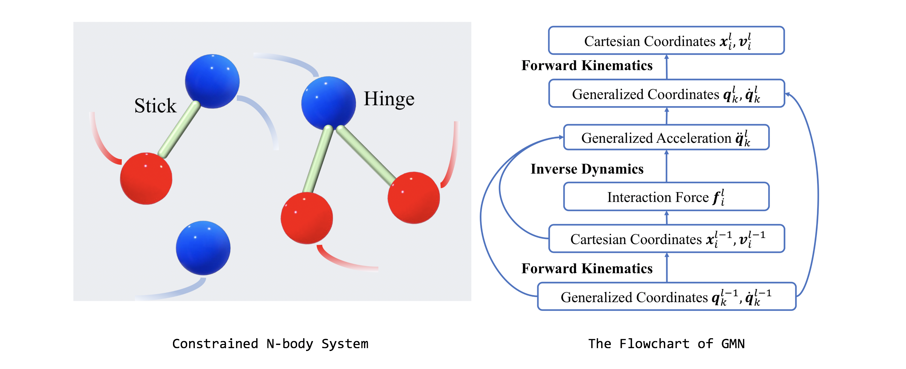
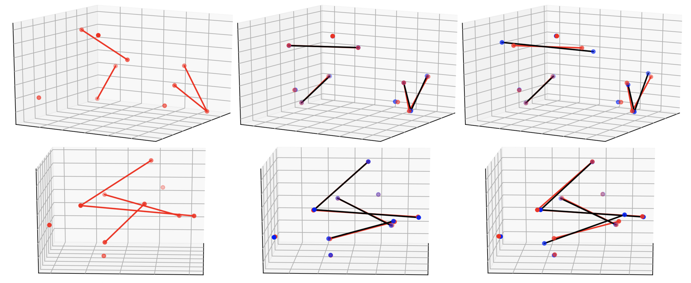
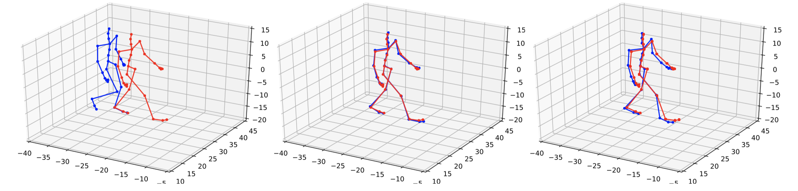

# Equivariant Graph Mechanics Networks with Constraints (ICLR 2022)

Wenbing Huang\*, Jiaqi Han\*, Yu Rong, Tingyang Xu, Fuchun Sun, Junzhou Huang

[](https://github.com/hanjq17/GMN/blob/main/LICENSE)

[**[OpenReview]**](https://openreview.net/forum?id=SHbhHHfePhP) [**[Paper]**](https://openreview.net/pdf?id=SHbhHHfePhP)

Graph Mechanics Networks (GMNs) are novel graph neural networks particularly powerful for modeling the dynamics of constrained systems. GMNs are equivariant to translations, rotations, and reflections. The flowchart of our model is provided in the figure below. Please refer to our paper for more details.

.

## Dependencies

```
python==3.8
torch==1.8.0
scikit-learn==0.24.2
networkx==2.5.1
```

A more detailed Python environment is depicted in `requirements.yml`.


## Data preparation

**1. Simulation Dataset**

Our simulation scripts are placed under `spatial_graph/n_body_system/dataset`.

To generate datasets containing multiple isolated particles, sticks, and hinges, use the following command under the path `spatial_graph/n_body_system/dataset`:

```bash
python -u generate_dataset.py --num-train 5000 --seed 43 --n_isolated 3 --n_stick 2 --n_hinge 1 --n_workers 50
```

where the arguments `n_isolated`, `n_stick`, and `n_hinge` indicate the number of isolated particles, sticks, and hinges, respectively. The argument `n_workers` refers to the number of parallel threads for parallel data generation. For other potential arguments, please refer to `generate_dataset.py`.

By default, the generated data will be placed in a new folder named `data` under the current path.

*Note:* On our CPU machine with 50 parallel workers, the entire data generation process takes from 10 minutes to 1~2 hours, depending on the complexity of the particle system (number of particles, sticks, and hinges).

**2. MD17**

The MD17 dataset can be downloaded from [MD17](http://quantum-machine.org/gdml/#datasets). Download the dataset and place the files under `spatial_graph/MD17`. The splits are also provided in the `MD17` folder.

**3. Motion Capture**

The raw data were obtained via [CMU Motion Capture Database](http://mocap.cs.cmu.edu/search.php?subjectnumber=35). The preprocessed dataset as well as the splits are provided in  `spatial_graph/motion` folder.


## Model training and evaluation

**1. Simulation Dataset**

Under the root path, simply use

```bash
python -u spatial_graph/main.py --config_by_file
```

where the `--config_by_file` option enables loading the hyper-parameters from the config files in `configs` folder.

To run experiments in different scenarios, simply change the hyper-parameters in the config files. For instance, one may change the `n_isolated`, `n_stick`, and `n_hinge` options to evaluate the model under various combinations of isolated particles, sticks, and hinges.

**2. MD17**

```bash
python -u spatial_graph/main_md17.py --config_by_file
```

**3. Motion Capture**

```bash
python -u spatial_graph/main_motion.py --config_by_file
```


## Visualizations

We exhibit some visualizations of the predictions as below (*Left*: initial position, *Middle*: GMN, *Right*: EGNN):

**Simulation dataset**



**Motion Capture**




## Citation

If you find our work hepful, please cite as:

```
@inproceedings{
huang2022constrained,
title={Constrained Graph Mechanics Networks},
author={Wenbing Huang and Jiaqi Han and Yu Rong and Tingyang Xu and Fuchun Sun and Junzhou Huang},
booktitle={International Conference on Learning Representations},
year={2022},
url={https://openreview.net/forum?id=SHbhHHfePhP}
}
```


## Contact

If you have any questions, feel free to reach us at:

hanjq21@mails.tsinghua.edu.cn

